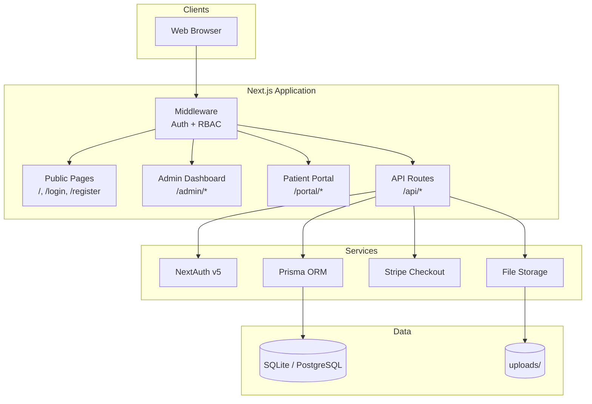

# Yooth Wellness Platform

**Yoothwell.com** — a production-oriented healthcare and wellness platform with an admin dashboard, patient portal, clinical workflows, lab tracking, treatment plans, orders, Stripe payments, consent forms, messaging, and scheduling.

---

## Documentation

| Guide | Description |
|-------|-------------|
| [Architecture](docs/ARCHITECTURE.md) | System design, layers, request flows, integrations |
| [Database Design](docs/DATABASE.md) | ER diagram, models, relationships, enums |
| [Project Setup](docs/SETUP.md) | Local install, env vars, migrations, seed data |
| [Development Guide](docs/DEVELOPMENT.md) | Folder structure, conventions, workflows |
| [API Reference](docs/API.md) | REST endpoints, auth, request/response shapes |
| [Auth & Permissions](docs/AUTH.md) | Roles, route protection, patient data access |

---

## Quick Start

```bash
npm install
cp .env.example .env
npm run db:migrate
npm run db:seed
npm run dev
```

Open **http://localhost:3000**

### Demo accounts

Password for all accounts: `password123`

| Role | Email | Portal |
|------|-------|--------|
| Admin | `admin@yoothwell.com` | `/admin` |
| Clinician | `clinician@yoothwell.com` | `/admin` |
| Patient | `patient@yoothwell.com` | `/portal` |
| Patient 2 | `john@yoothwell.com` | `/portal` |

---

## Platform Overview



---

## Features

| Area | Admin | Patient |
|------|:-----:|:-------:|
| Dashboard overview | ✅ | ✅ |
| Patient profiles & charts | ✅ | ✅ (own) |
| Lab results upload/review | ✅ review | ✅ upload |
| Treatment plans | ✅ view | ✅ view |
| Product recommendations | ✅ | ✅ |
| Orders & Stripe checkout | ✅ view | ✅ create |
| Consent forms | ✅ view | ✅ sign |
| Messaging | ✅ view | ✅ send |
| Appointments | ✅ view | ✅ view |
| Activity / audit log | ✅ | — |

---

## Tech Stack

| Layer | Technology |
|-------|------------|
| Framework | Next.js 16 (App Router) |
| Language | TypeScript |
| UI | Tailwind CSS, Radix UI primitives |
| Database | Prisma 7 + SQLite (dev) / PostgreSQL (prod) |
| Auth | NextAuth v5 (JWT + credentials) |
| Payments | Stripe Checkout + webhooks |
| Validation | Zod |

---

## Project Structure

```
yoothwellness/
├── docs/                    # Documentation (start here)
│   ├── ARCHITECTURE.md
│   ├── DATABASE.md
│   ├── SETUP.md
│   ├── DEVELOPMENT.md
│   ├── API.md
│   └── AUTH.md
├── prisma/
│   ├── schema.prisma        # Database schema
│   ├── seed.ts              # Demo data
│   └── migrations/          # Migration history
├── src/
│   ├── app/
│   │   ├── admin/           # Admin dashboard (staff only)
│   │   ├── portal/          # Patient portal
│   │   ├── api/             # API route handlers
│   │   ├── login/           # Auth pages
│   │   └── register/
│   ├── components/
│   │   ├── ui/              # Shared UI primitives
│   │   ├── layout/          # Sidebars
│   │   └── portal/          # Patient forms
│   ├── lib/                 # Core utilities
│   ├── auth.ts              # NextAuth config
│   └── middleware.ts        # Route protection
├── uploads/                 # Local file storage (gitignored)
├── .env.example
└── package.json
```

---

## NPM Scripts

| Command | Description |
|---------|-------------|
| `npm run dev` | Start development server |
| `npm run build` | Generate Prisma client + production build |
| `npm run start` | Run production server |
| `npm run lint` | Run ESLint |
| `npm run db:migrate` | Apply database migrations |
| `npm run db:seed` | Seed demo data |
| `npm run db:reset` | Reset DB, migrate, and reseed |
| `npm run db:generate` | Regenerate Prisma client |

---

## Environment Variables

See [Project Setup](docs/SETUP.md#environment-variables) for full details.

```env
DATABASE_URL="file:./dev.db"
AUTH_SECRET="your-secret-here"
AUTH_URL="http://localhost:3000"
STRIPE_SECRET_KEY="sk_test_..."
STRIPE_WEBHOOK_SECRET="whsec_..."
NEXT_PUBLIC_APP_URL="http://localhost:3000"
```

---

## Production Checklist

- [ ] Switch `DATABASE_URL` to PostgreSQL + `@prisma/adapter-pg`
- [ ] Set a strong `AUTH_SECRET` (`openssl rand -base64 32`)
- [ ] Configure Stripe keys and webhook (`POST /api/stripe/webhook`)
- [ ] Move file uploads to S3 or cloud storage
- [ ] Enable HTTPS and set `AUTH_URL` / `NEXT_PUBLIC_APP_URL` to production domain
- [ ] Review HIPAA/privacy requirements for your deployment

---

## Security

- **RBAC** — Admin, Clinician, and Patient roles with middleware + server-side checks
- **Patient scoping** — patients can only access their own clinical data
- **Authenticated uploads** — file preview routes require a valid session
- **Activity logging** — sensitive actions are recorded in `ActivityLog`
- **No secrets in repo** — `.env` and `uploads/` are gitignored

See [Auth & Permissions](docs/AUTH.md) for details.

---

## License

Proprietary — Yooth Wellness / Yoothwell.com
