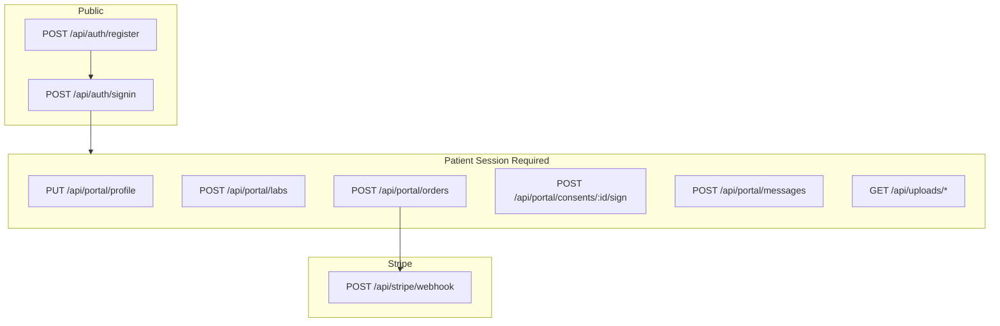

# API Reference

REST API endpoints for the Yooth Wellness platform. All `/api/portal/*` routes require an authenticated **Patient** session unless noted.

---

## Authentication

### NextAuth handlers

| Method | Path | Auth | Description |
|--------|------|------|-------------|
| `GET` | `/api/auth/[...nextauth]` | — | NextAuth session/csrf endpoints |
| `POST` | `/api/auth/[...nextauth]` | — | Login, logout, callback |

### Register

```
POST /api/auth/register
```

**Auth:** Public

**Body (JSON):**

```json
{
  "name": "Jane Doe",
  "email": "jane@example.com",
  "password": "securepassword"
}
```

| Field | Rules |
|-------|-------|
| `name` | min 2 characters |
| `email` | valid email, unique |
| `password` | min 8 characters |

**Responses:**

| Status | Body |
|--------|------|
| `201` | `{ "success": true }` |
| `400` | `{ "error": "Invalid input" }` |
| `409` | `{ "error": "Email already registered" }` |

Creates a `User` with role `PATIENT` and an empty `PatientProfile`.

---

## Patient Portal APIs

All routes below require `PATIENT` role. Unauthorized requests return `401`; wrong role returns redirect or `403`.

### Profile

```
PUT /api/portal/profile
```

**Body (JSON):**

```json
{
  "name": "Jane Doe",
  "phone": "555-1234",
  "dateOfBirth": "1985-06-15",
  "gender": "Female",
  "address": "123 Main St",
  "city": "Los Angeles",
  "state": "CA",
  "zipCode": "90001",
  "emergencyContact": "John Doe",
  "emergencyPhone": "555-5678",
  "medicalHistory": "None",
  "allergies": "Penicillin"
}
```

**Responses:**

| Status | Body |
|--------|------|
| `200` | `{ "success": true }` |
| `400` | `{ "error": "Invalid input" }` |
| `404` | `{ "error": "Profile not found" }` |

**Side effects:** `PROFILE_UPDATED` activity log entry

---

### Lab upload

```
POST /api/portal/labs
```

**Content-Type:** `multipart/form-data`

| Field | Type | Required |
|-------|------|:--------:|
| `testName` | string | ✅ |
| `testDate` | string (ISO date) | — |
| `file` | file (PDF, PNG, JPG) | ✅ |

**Responses:**

| Status | Body |
|--------|------|
| `201` | `{ "success": true, "id": "clx..." }` |
| `400` | `{ "error": "Test name and file are required" }` |

**Side effects:**
- Creates `LabResult` with status `PENDING`
- `LAB_UPLOADED` activity log
- Notifications sent to all active admins

---

### Create order

```
POST /api/portal/orders
```

**Body (JSON):**

```json
{
  "items": [
    { "productId": "clx...", "quantity": 2 },
    { "productId": "clx...", "quantity": 1 }
  ]
}
```

**Responses:**

| Status | Body |
|--------|------|
| `201` | `{ "success": true, "orderId": "...", "paymentUrl": "https://checkout.stripe.com/..." }` |
| `400` | `{ "error": "Invalid order" }` or `{ "error": "Invalid products" }` |

**Notes:**
- Tax calculated at 8% of subtotal
- If Stripe is configured, `paymentUrl` redirects to Checkout
- If Stripe is not configured, `paymentUrl` is `null` but order is still created

**Side effects:** `ORDER_CREATED` activity log

---

### Sign consent

```
POST /api/portal/consents/:id/sign
```

**Body (JSON):**

```json
{
  "signature": "Jane Doe"
}
```

**Responses:**

| Status | Body |
|--------|------|
| `200` | `{ "success": true }` |
| `400` | `{ "error": "Already signed" }` or `{ "error": "Invalid signature" }` |
| `403` | `{ "error": "Forbidden" }` |
| `404` | `{ "error": "Consent not found" }` |

**Side effects:** `CONSENT_SIGNED` activity log; consent status → `SIGNED`

---

### Send message

```
POST /api/portal/messages
```

**Body (JSON):**

```json
{
  "toId": "clx...",
  "subject": "Question about my labs",
  "body": "I had a question about my vitamin D results..."
}
```

| Field | Rules |
|-------|-------|
| `toId` | Must be an active `ADMIN` or `CLINICIAN` user |
| `subject` | min 1 character |
| `body` | min 1 character |

**Responses:**

| Status | Body |
|--------|------|
| `201` | `{ "success": true, "id": "clx..." }` |
| `400` | `{ "error": "Invalid message" }` or `{ "error": "Invalid recipient" }` |

**Side effects:**
- `MESSAGE_SENT` activity log
- Notification created for recipient

---

## File serving

```
GET /api/uploads/:folder/:filename
```

**Auth:** Required (any logged-in user)

**Allowed folders:** `labs`, `documents`, `consents`

**Responses:**

| Status | Description |
|--------|-------------|
| `200` | File content with appropriate `Content-Type` |
| `401` | Not authenticated |
| `403` | Invalid folder |
| `404` | File not found |

---

## Stripe webhook

```
POST /api/stripe/webhook
```

**Auth:** Stripe signature verification (`STRIPE_WEBHOOK_SECRET`)

**Handled events:**

| Event | Action |
|-------|--------|
| `checkout.session.completed` | Set order status to `PAID`, store `stripePaymentId`, log activity, notify patient |

**Responses:**

| Status | Body |
|--------|------|
| `200` | `{ "received": true }` |
| `400` | `{ "error": "Invalid signature" }` |

---

## Error response format

All API errors follow:

```json
{
  "error": "Human-readable message"
}
```

---

## API flow diagram



---

## Related Docs

- [Auth & Permissions](AUTH.md)
- [Architecture](ARCHITECTURE.md)
- [Database Design](DATABASE.md)
