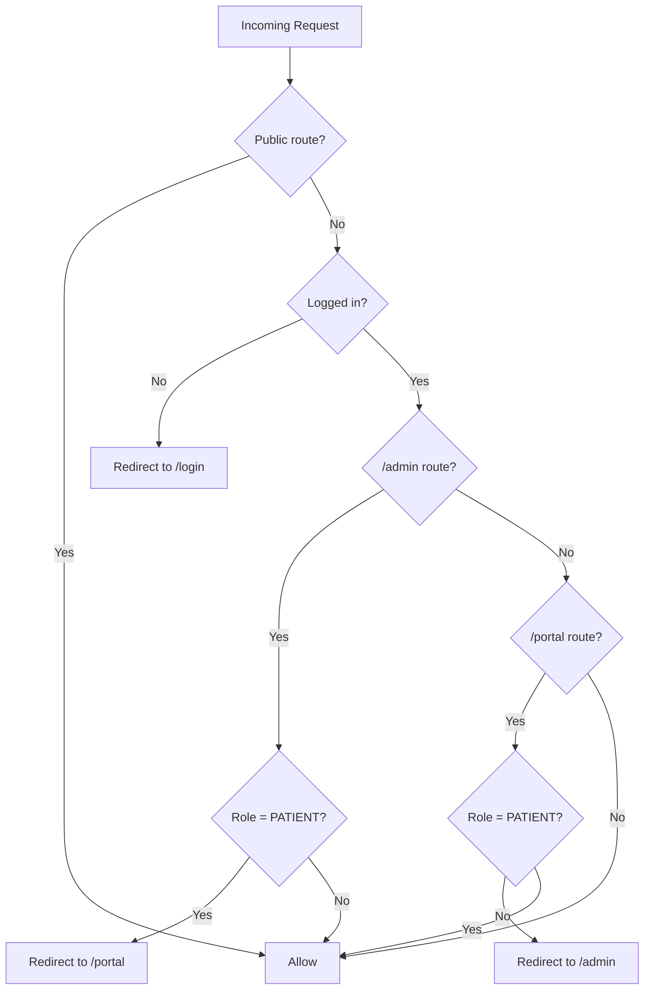
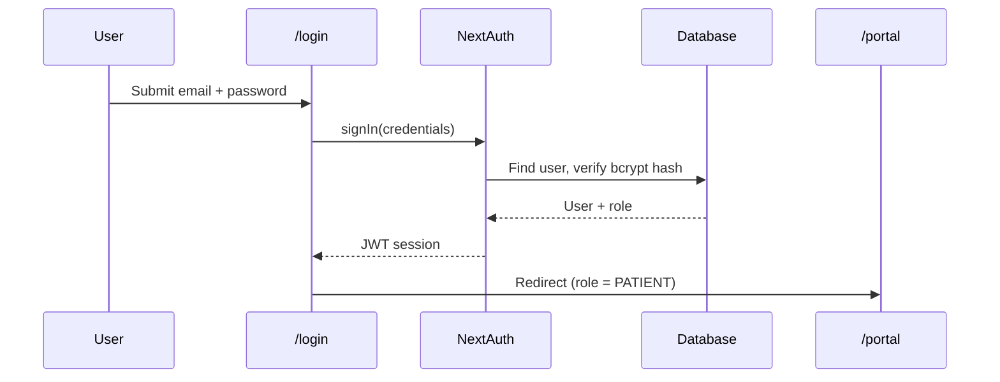
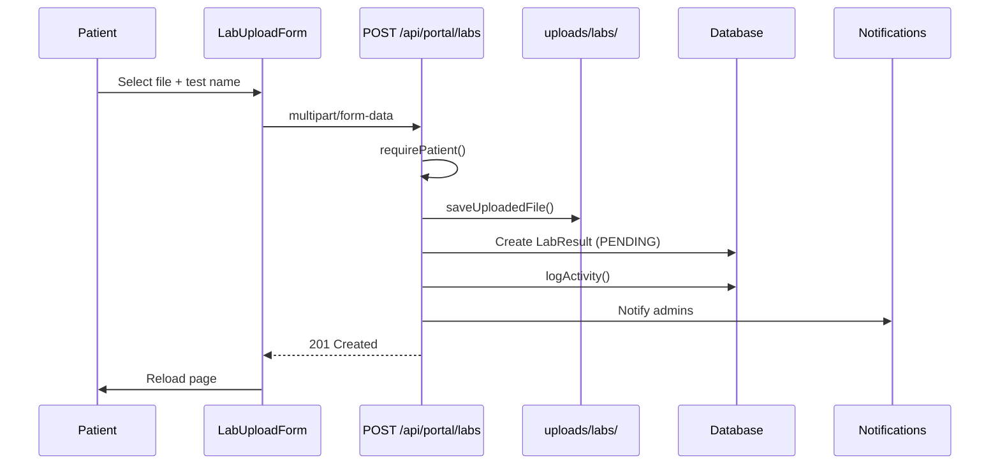
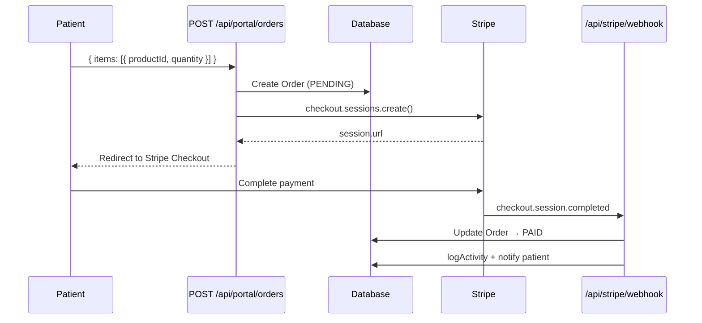
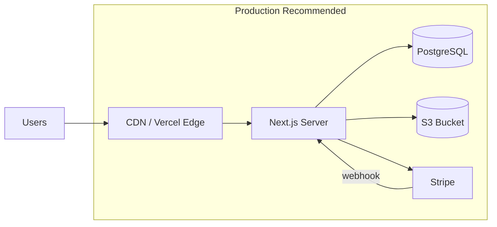

# Architecture

This document describes how the Yooth Wellness platform is structured — layers, request flows, module boundaries, and external integrations.

---

## High-Level Architecture

```mermaid
flowchart TB
    subgraph presentation [Presentation Layer]
        Pages[Server Components<br/>app/admin, app/portal]
        Client[Client Components<br/>forms, checkout, uploads]
        UI[UI Primitives<br/>components/ui]
    end

    subgraph application [Application Layer]
        MW[middleware.ts<br/>Route guard]
        AuthLib[lib/auth-utils.ts<br/>requireRole, requirePatient]
        PatientAccess[lib/patient-access.ts<br/>canAccessPatient]
        Activity[lib/activity.ts<br/>logActivity, notifications]
    end

    subgraph api [API Layer]
        AuthAPI[/api/auth/*]
        PortalAPI[/api/portal/*]
        StripeAPI[/api/stripe/webhook]
        UploadAPI[/api/uploads/*]
    end

    subgraph domain [Domain / Data Layer]
        Prisma[lib/prisma.ts]
        Schema[prisma/schema.prisma]
    end

    subgraph external [External Services]
        NextAuth[NextAuth v5]
        Stripe[Stripe API]
        FS[Local FS / S3]
    end

    Pages --> AuthLib
    Client --> PortalAPI
    Pages --> Prisma
    MW --> NextAuth
    PortalAPI --> PatientAccess
    PortalAPI --> Activity
    PortalAPI --> Prisma
    AuthAPI --> NextAuth
    StripeAPI --> Stripe
    UploadAPI --> FS
    Prisma --> Schema
```

---

## Application Layers

### 1. Presentation (`src/app/`, `src/components/`)

| Area | Path | Who accesses |
|------|------|--------------|
| Marketing / landing | `/` | Public |
| Auth | `/login`, `/register` | Public |
| Admin dashboard | `/admin/*` | Admin, Clinician |
| Patient portal | `/portal/*` | Patient |

- **Server Components** (default) — fetch data directly via Prisma in page files
- **Client Components** (`"use client"`) — forms, interactive UI (upload, checkout, messaging)
- **Layouts** — `admin/layout.tsx` and `portal/layout.tsx` wrap pages with sidebars

### 2. Middleware (`src/middleware.ts`)

Runs on every matched request **before** the page or API handler:



API routes (`/api/*`) bypass page-level redirects but still require auth checks inside each handler.

### 3. API Layer (`src/app/api/`)

| Namespace | Purpose |
|-----------|---------|
| `/api/auth/*` | NextAuth handlers + patient registration |
| `/api/portal/*` | Patient-scoped mutations (profile, labs, orders, messages, consents) |
| `/api/stripe/webhook` | Stripe payment confirmation |
| `/api/uploads/*` | Authenticated file serving |

### 4. Domain / Data (`src/lib/`, `prisma/`)

- **Prisma ORM** — single source of truth for database access
- **Business helpers** — `patient-access.ts`, `activity.ts`, `uploads.ts`, `stripe.ts`
- **No separate service layer** — handlers and pages call lib functions directly (intentionally simple for v1)

---

## Request Flow Examples

### Patient login



### Lab result upload



### Order checkout (Stripe)



---

## Module Map

### Admin modules

| Module | Page | Data sources |
|--------|------|--------------|
| Dashboard | `/admin` | Aggregated counts + recent activity |
| Patients | `/admin/patients` | `PatientProfile`, `User` |
| Patient chart | `/admin/patients/[id]` | Labs, plans, orders, recommendations |
| Labs | `/admin/labs` | `LabResult` |
| Treatment plans | `/admin/treatment-plans` | `TreatmentPlan` |
| Products | `/admin/products` | `Product` |
| Orders | `/admin/orders` | `Order`, `OrderItem` |
| Consents | `/admin/consents` | `ConsentForm` |
| Messages | `/admin/messages` | `Message` |
| Appointments | `/admin/appointments` | `Appointment` |
| Activity | `/admin/activity` | `ActivityLog` |

### Patient portal modules

| Module | Page | API |
|--------|------|-----|
| Dashboard | `/portal` | — (server fetch) |
| Profile | `/portal/profile` | `PUT /api/portal/profile` |
| Labs | `/portal/labs` | `POST /api/portal/labs` |
| Treatment | `/portal/treatment` | — (read-only) |
| Orders | `/portal/orders` | `POST /api/portal/orders` |
| Consents | `/portal/consents` | `POST /api/portal/consents/[id]/sign` |
| Messages | `/portal/messages` | `POST /api/portal/messages` |
| Appointments | `/portal/appointments` | — (read-only) |

---

## External Integrations

### NextAuth v5

- **Strategy**: JWT (no DB session table)
- **Provider**: Credentials (email + password)
- **Config**: `src/auth.ts`
- **Session shape**: `{ user: { id, email, name, role } }`

### Stripe

- **Checkout Sessions** — created when patient places an order
- **Webhook** — `checkout.session.completed` marks order as `PAID`
- **Config**: `src/lib/stripe.ts`
- **Graceful degradation**: orders are created even without Stripe keys; payment link is null

### File storage

- **Dev**: local `uploads/{labs,documents,consents}/`
- **Serving**: `GET /api/uploads/[...path]` (auth required)
- **Production recommendation**: S3 + signed URLs

---

## Deployment Topology



| Environment | Database | File storage | Notes |
|-------------|----------|--------------|-------|
| Local dev | SQLite (`dev.db`) | `uploads/` | Zero-config, seeded demo data |
| Staging | PostgreSQL | S3 | Mirror production |
| Production | PostgreSQL | S3 | Use `@prisma/adapter-pg` |

---

## Key Design Decisions

| Decision | Rationale |
|----------|-----------|
| App Router + Server Components | Fast initial loads, colocated data fetching |
| Prisma 7 with driver adapters | Type-safe queries, migration history |
| JWT auth (no session table) | Simpler v1; upgrade to DB sessions if needed |
| SQLite for dev | No external DB required to start |
| Activity log as JSON metadata | Flexible audit without schema churn |
| PatientProfile separate from User | Clinical data isolated; staff users have no profile |
| Middleware + server-side checks | Defense in depth for healthcare data |

---

## Related Docs

- [Database Design](DATABASE.md)
- [Auth & Permissions](AUTH.md)
- [API Reference](API.md)
- [Project Setup](SETUP.md)
