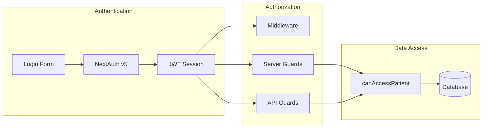
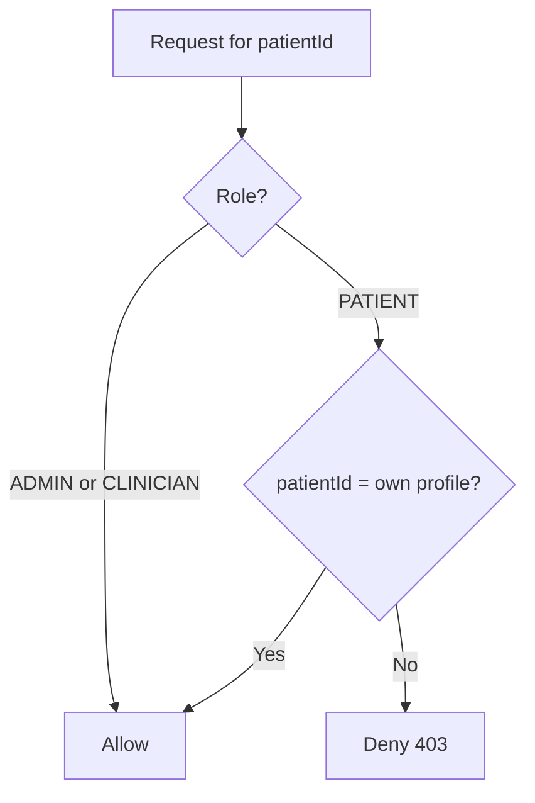

# Auth & Permissions

How authentication, authorization, and patient data access work in Yooth Wellness.

---

## Overview



| Layer | Mechanism | File |
|-------|-----------|------|
| Authentication | NextAuth credentials + JWT | `src/auth.ts` |
| Route protection | Middleware redirects | `src/middleware.ts` |
| Page guards | `requireAuth`, `requireRole` | `src/lib/auth-utils.ts` |
| Patient scoping | `canAccessPatient` | `src/lib/patient-access.ts` |

---

## Roles

| Role | Description | Default landing |
|------|-------------|-----------------|
| `ADMIN` | Full platform access, user management | `/admin` |
| `CLINICIAN` | Clinical workflows, patient care | `/admin` |
| `PATIENT` | Own profile and clinical data only | `/portal` |

### Permission matrix

| Resource | ADMIN | CLINICIAN | PATIENT |
|----------|:-----:|:---------:|:-------:|
| Admin dashboard | ✅ | ✅ | ❌ |
| Patient portal | ❌ | ❌ | ✅ |
| All patient records | ✅ | ✅ | ❌ |
| Own patient record | — | — | ✅ |
| Review labs | ✅ | ✅ | ❌ |
| Upload labs | ❌ | ❌ | ✅ (own) |
| Create orders | ❌ | ❌ | ✅ (own) |
| Sign consents | ❌ | ❌ | ✅ (own) |
| Send messages | ✅ | ✅ | ✅ |
| Activity log | ✅ | ✅ | ❌ |

---

## Authentication Flow

### Login

1. User submits email + password at `/login`
2. NextAuth `Credentials` provider looks up `User` by email
3. Password verified with `bcrypt.compare()` against `passwordHash`
4. Inactive users (`isActive = false`) are rejected
5. JWT issued with `{ id, email, name, role }`
6. Middleware redirects by role:
   - `PATIENT` → `/portal`
   - `ADMIN` / `CLINICIAN` → `/admin`

### Registration

1. Public form at `/register`
2. `POST /api/auth/register` creates `PATIENT` user + empty `PatientProfile`
3. Password hashed with bcrypt (12 rounds)
4. User redirected to `/login`

### Session

- **Strategy:** JWT (no database session table)
- **Duration:** NextAuth defaults (30 days with activity)
- **Client access:** `useSession()` from `next-auth/react`
- **Server access:** `auth()` or `getCurrentUser()`

```typescript
// Server component or API route
import { getCurrentUser, requirePatient } from "@/lib/auth-utils";

const user = await getCurrentUser();        // null if not logged in
const patient = await requirePatient();    // redirects to /login if not patient
```

---

## Route Protection

### Middleware (`src/middleware.ts`)

| Route pattern | Rule |
|---------------|------|
| `/`, `/login`, `/register` | Public |
| `/api/auth/*` | Public |
| `/admin/*` | Staff only; patients redirected to `/portal` |
| `/portal/*` | Patients only; staff redirected to `/admin` |
| All other routes | Login required |

### Server-side guards

```typescript
await requireAuth();                    // any logged-in user
await requireStaff();                   // ADMIN or CLINICIAN
await requireAdmin();                   // ADMIN only
await requirePatient();                 // PATIENT only
await requireRole(Role.ADMIN, Role.CLINICIAN);
```

Guards redirect to `/login` or `/unauthorized` — they do not silently fail.

---

## Patient Data Access

### Rule

> Patients can **only** access records linked to their own `PatientProfile`.
> Staff can access **all** patient records.

### Implementation

```typescript
import { canAccessPatient, getPatientIdForUser } from "@/lib/patient-access";

// Check before returning data
const allowed = await canAccessPatient(user.id, user.role, patientId);

// Get current patient's profile ID
const patientId = await getPatientIdForUser(user.id);
```

### How it works



---

## File Access

Uploaded files (`/api/uploads/*`) require any valid session. In v1, all authenticated users can access files if they know the URL.

**Production recommendation:** scope file access by patient ownership and use signed URLs with expiration.

---

## Password Security

| Aspect | Implementation |
|--------|----------------|
| Hashing | bcrypt, 12 salt rounds |
| Storage | `User.passwordHash` only — never plaintext |
| Registration min length | 8 characters |
| Comparison | `bcrypt.compare()` in NextAuth authorize |

---

## Activity & Audit

Sensitive actions are logged to `ActivityLog`:

| Action | Trigger |
|--------|---------|
| `USER_REGISTERED` | New patient registration |
| `PROFILE_UPDATED` | Patient updates profile |
| `LAB_UPLOADED` | Patient uploads lab file |
| `ORDER_CREATED` | Patient creates order |
| `ORDER_PAID` | Stripe webhook confirms payment |
| `CONSENT_SIGNED` | Patient signs consent |
| `MESSAGE_SENT` | Patient sends message |

View logs at `/admin/activity` (staff only).

---

## Security Considerations

### Healthcare / HIPAA awareness

This platform provides **technical controls** (RBAC, patient scoping, audit logs) but is **not HIPAA-certified out of the box**. Before handling real PHI in production:

- Execute a BAA with hosting and storage providers
- Encrypt data at rest and in transit
- Implement session timeout policies
- Add MFA for staff accounts
- Review file storage access controls
- Conduct a security risk assessment

### Middleware limitations

Middleware runs on the Edge runtime and cannot use Prisma. Role checks use the JWT `role` claim only. **Always** enforce access again in server components and API handlers.

### JWT considerations

JWTs cannot be revoked before expiry without a blocklist. For higher security, migrate to database sessions.

### Environment secrets

| Secret | Purpose |
|--------|---------|
| `AUTH_SECRET` | Signs JWTs — compromise = full session forgery |
| `STRIPE_WEBHOOK_SECRET` | Verifies webhook authenticity |
| `DATABASE_URL` | Full database access |

Never commit these to version control.

---

## Extending Auth

### Add MFA (future)

1. Add `mfaEnabled`, `mfaSecret` to `User` model
2. Add verification step after credentials check in `auth.ts`
3. Consider switching to database sessions

### Add OAuth (Google, etc.)

```typescript
// src/auth.ts
import Google from "next-auth/providers/google";

providers: [
  Google({ clientId: "...", clientSecret: "..." }),
  Credentials({ ... }),
]
```

Link OAuth accounts to existing users by email.

### Add staff user creation

Admin-only API:
1. `requireAdmin()`
2. Create `User` with `role: ADMIN | CLINICIAN`
3. Do **not** create `PatientProfile` for staff

---

## Related Docs

- [Architecture](ARCHITECTURE.md)
- [API Reference](API.md)
- [Database Design](DATABASE.md)
- [Project Setup](SETUP.md)
