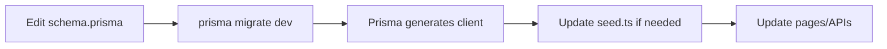

# Development Guide

Conventions, workflows, and patterns for contributing to Yooth Wellness.

---

## Folder Structure

```
src/
├── app/                      # Next.js App Router
│   ├── page.tsx              # Landing page (public)
│   ├── layout.tsx            # Root layout + providers
│   ├── globals.css           # Tailwind + CSS variables
│   ├── middleware.ts         # ⚠️ lives at src/middleware.ts
│   │
│   ├── admin/                # Staff dashboard (ADMIN + CLINICIAN)
│   │   ├── layout.tsx        # Admin sidebar wrapper
│   │   ├── page.tsx          # Dashboard
│   │   ├── patients/
│   │   ├── labs/
│   │   └── ...
│   │
│   ├── portal/               # Patient portal (PATIENT only)
│   │   ├── layout.tsx        # Portal sidebar wrapper
│   │   ├── page.tsx          # Patient dashboard
│   │   └── ...
│   │
│   ├── api/                  # Route handlers
│   │   ├── auth/
│   │   ├── portal/
│   │   ├── stripe/
│   │   └── uploads/
│   │
│   ├── login/
│   └── register/
│
├── components/
│   ├── ui/                   # Reusable primitives (Button, Card, Input…)
│   ├── layout/               # AdminSidebar, PortalSidebar
│   └── portal/               # Patient-specific client forms
│
├── lib/                      # Shared server utilities
│   ├── prisma.ts             # DB client singleton
│   ├── auth-utils.ts         # requireAuth, requireRole, requirePatient
│   ├── patient-access.ts     # canAccessPatient, getPatientProfileForUser
│   ├── activity.ts           # logActivity, createNotification
│   ├── uploads.ts            # saveUploadedFile
│   ├── stripe.ts             # getStripe()
│   └── utils.ts              # cn(), formatDate(), formatCurrency()
│
├── auth.ts                   # NextAuth configuration
├── types/next-auth.d.ts      # Session type extensions
└── generated/prisma/         # Auto-generated — do not edit
```

---

## Coding Conventions

### Server vs client components

| Use | When |
|-----|------|
| Server Component (default) | Data fetching, admin list pages, dashboards |
| Client Component (`"use client"`) | Forms, interactivity, `useState`, `useRouter`, `signIn` |

```tsx
// ✅ Server page — fetch directly
export default async function AdminLabsPage() {
  await requireStaff();
  const labs = await prisma.labResult.findMany({ ... });
  return <DataTable>...</DataTable>;
}
```

```tsx
// ✅ Client form — user interaction
"use client";
export function LabUploadForm() { ... }
```

### Auth guards

Always protect server pages and API routes:

```typescript
// Staff pages
await requireStaff();   // ADMIN or CLINICIAN

// Admin-only
await requireAdmin();   // ADMIN only

// Patient pages
await requirePatient(); // PATIENT only
```

### Patient data access

Before returning patient data in APIs:

```typescript
const hasAccess = await canAccessPatient(userId, role, patientId);
if (!hasAccess) return NextResponse.json({ error: "Forbidden" }, { status: 403 });
```

### Activity logging

Log sensitive mutations:

```typescript
await logActivity({
  actorId: user.id,
  patientId: profile.id,
  action: "LAB_UPLOADED",
  entityType: "LabResult",
  entityId: lab.id,
});
```

### Validation

Use Zod in API routes:

```typescript
const schema = z.object({ email: z.string().email() });
const parsed = schema.safeParse(body);
if (!parsed.success) return NextResponse.json({ error: "Invalid input" }, { status: 400 });
```

---

## Adding a New Feature

### Example: add a "Documents" page to patient portal

**1. Database** (if new model needed)

Edit `prisma/schema.prisma`, then:

```bash
npm run db:migrate
```

**2. API route** (if mutations needed)

Create `src/app/api/portal/documents/route.ts`:

```typescript
export async function POST(request: Request) {
  const user = await requirePatient();
  // validate, check access, prisma create, logActivity
}
```

**3. Portal page**

Create `src/app/portal/documents/page.tsx` (server component).

**4. Client form** (if needed)

Create `src/components/portal/document-upload-form.tsx`.

**5. Navigation**

Add link in `src/components/layout/portal-sidebar.tsx`.

**6. Middleware**

Portal routes under `/portal/*` are already protected for patients only.

---

## UI Guidelines

- Use existing primitives from `components/ui/`
- Color palette: teal primary (`teal-600`), slate neutrals
- Layout: sidebar + `max-w-7xl` content area
- Use `PageHeader`, `DataTable`, `StatCard`, `EmptyState` from `page-elements.tsx`
- Status badges via `Badge` component with variants: `success`, `warning`, `danger`, `info`

---

## Database Workflow



Never edit files in `src/generated/prisma/` — they are overwritten on `prisma generate`.

---

## Git Workflow

```bash
# Create feature branch
git checkout -b cursor/your-feature-name-d8a7

# Commit with descriptive message
git add .
git commit -m "Add patient document upload feature"

# Push
git push -u origin cursor/your-feature-name-d8a7
```

---

## Testing Checklist (manual)

Before opening a PR, verify:

- [ ] `npm run build` passes
- [ ] Affected pages load without errors
- [ ] Auth: correct role can access, wrong role is redirected
- [ ] Patient cannot access another patient's data
- [ ] API returns 401/403 for unauthorized requests
- [ ] Sensitive actions appear in `/admin/activity`
- [ ] Forms show loading and error states

---

## Common Patterns

### Formatting

```typescript
import { formatDate, formatCurrency, formatDateShort } from "@/lib/utils";

formatDate(order.createdAt)      // "Jun 17, 2026, 1:06 AM"
formatDateShort(patient.dob)     // "Jun 15, 1985"
formatCurrency(29.99)            // "$29.99"
```

### Conditional badge variant

```typescript
<Badge variant={status === "PAID" ? "success" : "warning"}>{status}</Badge>
```

### Not found handling

```typescript
import { notFound } from "next/navigation";

const patient = await prisma.patientProfile.findUnique({ where: { id } });
if (!patient) notFound();
```

---

## What NOT to Do

| ❌ Avoid | ✅ Instead |
|----------|-----------|
| Exposing patient data without access checks | Use `canAccessPatient()` |
| Storing plaintext passwords | bcrypt via `bcryptjs` |
| Committing `.env` or `dev.db` | Use `.env.example` |
| Importing Prisma in middleware | Use string role checks only |
| Editing generated Prisma files | Change `schema.prisma` |
| Mock auth in production paths | Real NextAuth session checks |

---

## Related Docs

- [Architecture](ARCHITECTURE.md)
- [API Reference](API.md)
- [Auth & Permissions](AUTH.md)
- [Project Setup](SETUP.md)
